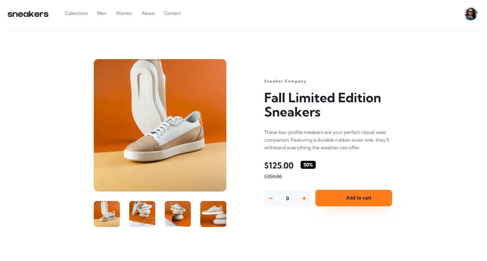

# E-commerce Product Page

A responsive e-commerce product page developed as a solution to the **E-commerce Product Page** challenge from [Frontend Mentor](https://www.frontendmentor.io/challenges/ecommerce-product-page-UPsZ9MJp6).

The project focuses on building a realistic product page with an interactive image gallery, shopping cart functionality, responsive layouts and accessibility considerations.

## 🚀 Live Demo

[View the live site](https://rodrigojesus7.github.io/e-commerce-product-page/)

## 📸 Preview

## ✨ Features
* Responsive layout for desktop, tablet and mobile devices
* Mobile navigation menu
* Interactive product image gallery
* Lightbox image gallery on desktop
* Previous and next image navigation
* Product thumbnail selection
* Product quantity selector
* Add products to the shopping cart
* Shopping cart with product quantity and total price
* Remove products from the cart
* Empty cart state
* Interactive buttons and navigation elements
* Accessible labels and ARIA attributes
* Semantic HTML structure

## 🛠️ Built With

* HTML5
* CSS3
* JavaScript
* Flexbox
* Responsive Design
* Accessibility (ARIA)

## ♿ Accessibility

Accessibility was considered throughout the development of the project.

Some of the implemented practices include:

* Semantic HTML elements such as `header`, `nav`, `main` and `article`
* Descriptive `aria-label` attributes for interactive buttons
* `aria-controls` to establish relationships between controls and the elements they operate
* `aria-expanded` to communicate the state of expandable components
* `aria-live` for dynamically updated content such as the product quantity
* Descriptive alternative text for meaningful images
* Empty `alt` attributes for decorative images
* Keyboard-friendly interactive elements using native buttons and links

## 📱 Responsive Design

The page adapts to different screen sizes, providing different navigation and layout behaviors for mobile and desktop users.

The responsive layout was built using CSS media queries and flexible layout techniques.

## 🎯 What I Learned

This project helped me practice and improve my knowledge of:

* Building responsive interfaces from a design
* Structuring pages with semantic HTML
* Creating interactive components with JavaScript
* Manipulating the DOM
* Managing UI state with JavaScript
* Creating image galleries and lightboxes
* Implementing shopping cart interactions
* Applying accessibility principles to interactive elements
* Using ARIA attributes appropriately
* Improving web performance and validating the project with Lighthouse
* Organizing CSS using a consistent naming convention

## 💡 Challenge

This project was created as part of a challenge from **Frontend Mentor**, which provides professional designs to help developers improve their frontend development skills.

The goal was to reproduce the provided design as accurately as possible while making the page responsive and interactive.

## 👨‍💻 Author

**Rodrigo Costa**

Frontend Developer in transition to technology, currently focused on improving my skills in HTML, CSS, JavaScript, React and TypeScript.

